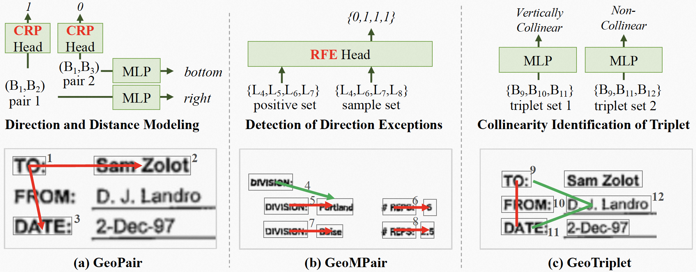

# GeoLayoutLM - Codebase
Code updated for finetuning of custom dataset.

## Update config file
Update the `configs/finetune_funsd.yaml` file, and specify the following parameters: <br>
1. `workspace` - Name of the folder where you want to dump the trained models and tensorboard logs.
2. `dataset` - If you are using a custom dataset add the dataset name, also update line no. 55 of the script `utils/__init__.py` in the following manner: 
```py
elif cfg.dataset == 'custom_dataset_name':
  cfg.dataset_root_path = os.path.join(cfg.dataset_root_path, "path_to_custom_dataset")
  cfg.model.n_classes = 2 * total_num_of_classes + 1
```
3. `dump_dir`: Name of the folder where you want to dump the evaluation results.

## Dependencies
Install dependencies :
```
pip install -r requirements.txt
```

## Run OCR
Running the OCR script is critical as it gives the key-value indicator for further processing. This step is advised if the key-value links are not already annotated in the dataset.
To run the script:
```
python aws.py (if using AWS for da that visualization is correctly prepared only when running 'linking' model and visualization related to entity linking)
1) python funsd_gv.pyta preparation)
python funsd_gv.py (if using Google vision for data preparation)
note : make sure that you have already generated the OCR data using GV
```

## Preprocessing

Go to the folder: 
```
cd preprocess/custom
```
Run the scripts in the mentioned order:
1. To prepare data in FUNSD-like format:
```
python ./preprocess/custom/prepare_data_final.py
```
2. Process data for training:
```
python preprocess_for_training.py
```

## Training
Run the train script:
```
python train.py --config=configs/finetune_funsd.yaml
```
```
Note : make sure you have made these changes
1) in finetune_funsd.yaml
=>workspace: <<root path >> /results/custom_trial
=> dataset: custom
=>dataset_root_path: <<data in funsd format>> /results/dataset
=> num_samples_per_epoch: no.of samples in train data/3
2) utils/__init__.py
=> num_classes = << change to no.of classes >>
3) every time reupload the 'geolayoutlm_large_pretrain.pt' to the path : geo-layout-lm-tf/
```
ONLY FOR INFERENCE
## Running the results generation script
1. Run the evaluation script to generated necessary result files and visualizations (note that visualization is correctly prepared only when running 'linking' model and visualization related to entity linking)
1) python funsd_gv.py
2) preprocess_for_val_data_2.py

```
python inference.py --config=configs/val_config.yml 
```

2. Run merge prediction script to merge the splitted files:
```
python3 ./inference/merge_predictions.py
```
3. Run clustering the tokens script to merge the prediction (Note: horizental and vertical merging happend in this script)

```
python3 ./inference/clustering_the_tokens.py
```

PS: The spacings between the actual text and also the predicted texts were removed to generate a more accurate complete match percentage
python evaluate.py

4. In the final, we have to run postprocessing script to generate the reports

```
python3 ./inference/clustering_the_tokens.py
``` 


## Running the postprocessing Module

1. The script used to merge the master data

```
python3 ./postprocessing/master_data_merger_latest.py
```  
2. The following script used to generate the final reports
```
python3 ./postprocessing/accuracy_gen_script.py
``` 

```
python3 ./postprocessing/report_generation_single.step2.py
```

```
python3 ./postprocessing/important_fields_extractor.py
```
 _______________________________________________________
Trailing --------------------------------

## Paper
- [CVPR 2023](https://openaccess.thecvf.com/content/CVPR2023/papers/Luo_GeoLayoutLM_Geometric_Pre-Training_for_Visual_Information_Extraction_CVPR_2023_paper.pdf)
- [arXiv](https://arxiv.org/abs/2304.10759)

GeoLayoutLM is a multi-modal framework for Visual Information Extraction (VIE, including SER and RE), which incorporates the novel **geometric pre-training**.
Additionally, novel **relation heads**, which are pre-trained by the geometric pre-training tasks and fine-tuned for RE, are designed to enrich and enhance the feature representation.
GeoLayoutLM achieves highly competitive scores in the SER task, and significantly outperforms the previous state-of-the-arts for RE.



<!--  -->
## Environment
The dependencies are listed in `requirements.txt`. Please install a proper torch version matching your cuda version first.
```
pip install -r requirements.txt
```

## Model Checkpoints
We released the pre-trained model for downstream fine-tuning.
Also, we provided SER and RE models fine-tuned on FUNSD.

|    | Pre-trained model | SER model | RE model |
|:--:|:-----------------:|:---------:|:--------:|
|Download|[LINK](https://github.com/AlibabaResearch/AdvancedLiterateMachinery/releases/download/v1.1.0-geolayoutlm-model/geolayoutlm_large_pretrain.pt)| [LINK](https://github.com/AlibabaResearch/AdvancedLiterateMachinery/releases/download/v1.1.0-geolayoutlm-model/epoch.105-f1_labeling.0.9232.pt) | [LINK](https://github.com/AlibabaResearch/AdvancedLiterateMachinery/releases/download/v1.1.0-geolayoutlm-model/epoch.182-f1_linking.0.8923.pt) |
| F1 | - | 92.32 | 89.23 |

Note that the training with the vision module causes unstable final performance, i.e., multiple independent experiments will have diffenrent F1 scores.

## Fine-tuning
### Preprocess the data
- FUNSD

[FUNSD](https://guillaumejaume.github.io/FUNSD/) is a dataset for form understanding. It is widely used in the VIE task.
```
cd preprocess/funsd_el/
python preprocess.py
```

### Fine-tune and Evaluate
```
CUDA_VISIBLE_DEVICES=0 python train.py --config=configs/finetune_funsd.yaml
CUDA_VISIBLE_DEVICES=0 python evaluate.py --config=configs/finetune_funsd.yaml [--pretrained_model_file=path/to/xx.pt]
```

## Multi-lingual base model
We also released a base model pre-trained on Chinese and English documents.
Refer to [modelscope](https://www.modelscope.cn/models/damo/multi-modal_convnext-roberta-base_vldoc-embedding/summary) for more details.

## Acknowledgments
We implemented the fine-tuning based on the code of [BROS](https://github.com/clovaai/bros).

## Citation
Please cite our paper if the work helps you.
```
@article{cvpr2023geolayoutlm,
  title={GeoLayoutLM: Geometric Pre-training for Visual Information Extraction},
  author={Chuwei Luo and Changxu Cheng and Qi Zheng and Cong Yao},
  journal={2023 IEEE/CVF Conference on Computer Vision and Pattern Recognition (CVPR)},
  year={2023}
}
```

## License
```
Copyright 2023-present Alibaba Group.

Licensed under the Apache License, Version 2.0 (the "License");
you may not use this file except in compliance with the License.
You may obtain a copy of the License at

    http://www.apache.org/licenses/LICENSE-2.0

Unless required by applicable law or agreed to in writing, software
distributed under the License is distributed on an "AS IS" BASIS,
WITHOUT WARRANTIES OR CONDITIONS OF ANY KIND, either express or implied.
See the License for the specific language governing permissions and
limitations under the License.
```
